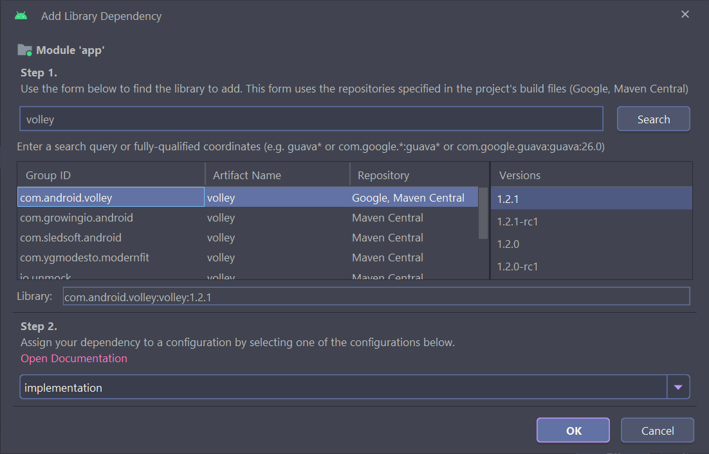
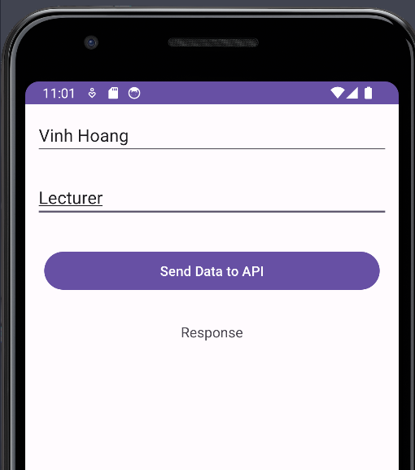
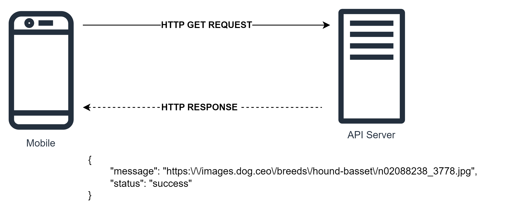

# Make HTTP Post Request

## Introduction

Many android applications use APIs within their application so that they can interact with the database 
and perform read and write operations on the database. 

There are several libraries which we can use to make API calls within our android application. 

We will take a look at How to send POST requests in JSON using HTTP Client in Android.

## Creating a new project in Android Studio

Create the new Android Project with Java language

## Adding Dependency

Add `volley` dependency



## Adding internet permissions in `AndroidManifest.xml` file

As we are getting data from the internet using URLs we have to add internet permissions within our android application to access the internet to load this data. So we have to add internet permission.

For adding internet permissions. Navigate to `app` > `AndroidManifest.xml` file and add below permission to it above the application tag.

```xml
<?xml version="1.0" encoding="utf-8"?>
<manifest xmlns:android="http://schemas.android.com/apk/res/android"
    xmlns:tools="http://schemas.android.com/tools">
    <uses-permission android:name="android.permission.INTERNET"/>
```

## Working with `activity_main.xml`

Navigate to `activity_main.xml`. If this file is not visible. 

To open this file. In the left pane navigate to `app` >`res` > `layout` > `activity_main.xml` to open this file. 

After opening this file. Add the below code to it.

Comments are added in the code to get to know in detail.

```xml
<?xml version="1.0" encoding="utf-8"?>
<LinearLayout
    xmlns:android="http://schemas.android.com/apk/res/android"
    xmlns:tools="http://schemas.android.com/tools"
    android:layout_width="match_parent"
    android:layout_height="match_parent"
    android:orientation="vertical"
    tools:context=".MainActivity">

    <!--edit text field for adding name-->
    <EditText
        android:id="@+id/idEdtName"
        android:layout_width="match_parent"
        android:layout_height="wrap_content"
        android:layout_margin="10dp"
        android:layout_marginTop="40dp"
        android:hint="Enter your name" />

    <!--edit text for adding job-->
    <EditText
        android:id="@+id/idEdtJob"
        android:layout_width="match_parent"
        android:layout_height="wrap_content"
        android:layout_margin="10dp"
        android:hint="Enter your job" />

    <!--button for adding data-->
    <Button
        android:id="@+id/idBtnPost"
        android:layout_width="match_parent"
        android:layout_height="wrap_content"
        android:layout_margin="20dp"
        android:text="Send Data to API"
        android:textAllCaps="false" />

    <!--text view for displaying our API response-->
    <TextView
        android:id="@+id/idTVResponse"
        android:layout_width="match_parent"
        android:layout_height="wrap_content"
        android:layout_margin="10dp"
        android:gravity="center_horizontal"
        android:text="Response"
        android:textAlignment="center"
        android:textSize="15sp" />

    <!--progress bar for loading -->
    <ProgressBar
        android:id="@+id/idLoadingPB"
        android:layout_width="wrap_content"
        android:layout_height="wrap_content"
        android:layout_gravity="center"
        android:visibility="gone" />

</LinearLayout>

```

## Working with `MainActivity.java`

Add below code to the `MainActivity.java`

```java
package com.example.comp1786_l6_android_communication;

import android.os.Bundle;
import android.view.View;
import android.widget.Button;
import android.widget.EditText;
import android.widget.ProgressBar;
import android.widget.TextView;
import android.widget.Toast;

import androidx.appcompat.app.AppCompatActivity;

import com.android.volley.Request;
import com.android.volley.RequestQueue;
import com.android.volley.VolleyError;
import com.android.volley.toolbox.StringRequest;
import com.android.volley.toolbox.Volley;

import org.json.JSONException;
import org.json.JSONObject;

import java.util.HashMap;
import java.util.Map;

public class MainActivity extends AppCompatActivity {

    // creating variables for our edittext,
    // button, textview and progressbar.
    private EditText nameEdt, jobEdt;
    private Button postDataBtn;
    private TextView responseTV;
    private ProgressBar loadingPB;

    @Override
    protected void onCreate(Bundle savedInstanceState) {
        super.onCreate(savedInstanceState);
        setContentView(R.layout.activity_main);

        // initializing our views
        nameEdt = findViewById(R.id.idEdtName);
        jobEdt = findViewById(R.id.idEdtJob);
        postDataBtn = findViewById(R.id.idBtnPost);
        responseTV = findViewById(R.id.idTVResponse);
        loadingPB = findViewById(R.id.idLoadingPB);

        // adding on click listener to our button.
        postDataBtn.setOnClickListener(new View.OnClickListener() {
            @Override
            public void onClick(View v) {
                // validating if the text field is empty or not.
                if (nameEdt.getText().toString().isEmpty() && jobEdt.getText().toString().isEmpty()) {
                    Toast.makeText(MainActivity.this, "Please enter both the values", Toast.LENGTH_SHORT).show();
                    return;
                }
                // calling a method to post the data and passing our name and job.
                postDataUsingVolley(nameEdt.getText().toString(), jobEdt.getText().toString());
            }
        });
    }

    private void postDataUsingVolley(String name, String job) {
        // url to post our data
        String url = "https://reqres.in/api/users";
        loadingPB.setVisibility(View.VISIBLE);

        // creating a new variable for our request queue
        RequestQueue queue = Volley.newRequestQueue(MainActivity.this);

        // on below line we are calling a string
        // request method to post the data to our API
        // in this we are calling a post method.
        StringRequest request = new StringRequest(Request.Method.POST, url, new com.android.volley.Response.Listener<String>() {
            @Override
            public void onResponse(String response) {
                // inside on response method we are
                // hiding our progress bar
                // and setting data to edit text as empty
                loadingPB.setVisibility(View.GONE);
                nameEdt.setText("");
                jobEdt.setText("");

                // on below line we are displaying a success toast message.
                Toast.makeText(MainActivity.this, "Data added to API", Toast.LENGTH_SHORT).show();
                try {
                    // on below line we are parsing the response
                    // to json object to extract data from it.
                    JSONObject respObj = new JSONObject(response);

                    // below are the strings which we
                    // extract from our json object.
                    String name = respObj.getString("name");
                    String job = respObj.getString("job");

                    // on below line we are setting this string s to our text view.
                    responseTV.setText("Name : " + name + "\n" + "Job : " + job);
                } catch (JSONException e) {
                    e.printStackTrace();
                }
            }
        }, new com.android.volley.Response.ErrorListener() {
            @Override
            public void onErrorResponse(VolleyError error) {
                // method to handle errors.
                Toast.makeText(MainActivity.this, "Fail to get response = " + error, Toast.LENGTH_SHORT).show();
            }
        }) {
            @Override
            protected Map<String, String> getParams() {
                // below line we are creating a map for
                // storing our values in key and value pair.
                Map<String, String> params = new HashMap<String, String>();

                // on below line we are passing our key
                // and value pair to our parameters.
                params.put("name", name);
                params.put("job", job);

                // at last we are
                // returning our params.
                return params;
            }
        };
        // below line is to make
        // a json object request.
        queue.add(request);
    }
}

```

Now, we can make POST request






