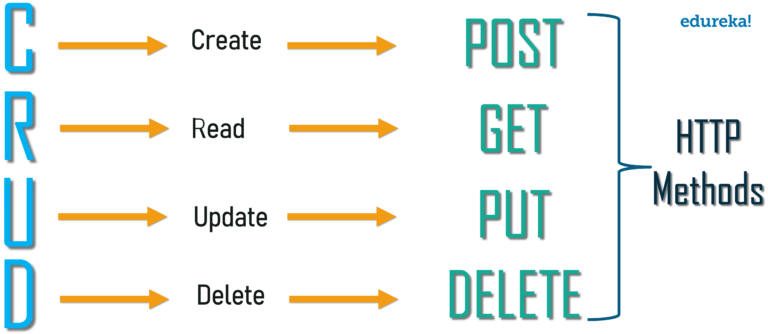

# What is HTTP Request and HTTP Response headers?

HTTP requests are like asking for something from a server, and HTTP responses are the server's replies. It's like sending a message and receiving a reply.

An HTTP request header is an extra piece of information you include when making a request, such as what kind of data you are sending or who you are. In response headers, the server provides information about the response it is sending you, such as what type of data you're receiving or if you have special instructions.


## What is REST API ?


## Methods of REST API



## HTTP Codes


## Example with Insomnia (REST API client)


# Overview of the Application

We will be building a simple app in which we will use an ImageView for showing images of dogs and
a button to get an image of another dog. 

Whenever the button will be pressed, a new HTTP request will be made for fetching a dog image and it will be displayed in the ImageView.


## Create a New Project in Android Studio

Create new project with Java language

## Add the Required Dependencies

Volley Library Dependency.


Glide Image Processing Library for Caching and Loading Images from the Image URL Retrieved from the HTTP Request.


## Adding Internet Usage Permissions to AndroidManifest.xml File

Navigate to `app` > `manifests` > `AndroidManifest.xml` and add the piece of code given below to the file.

```xml
<?xml version="1.0" encoding="utf-8"?>
<manifest xmlns:android="http://schemas.android.com/apk/res/android"
    xmlns:tools="http://schemas.android.com/tools">
    <uses-permission android:name="android.permission.INTERNET"/>
```

## Working with the XML Files

Navigate to the `app` > `res` > `layout` > `activity_main.xml` and add the below code to that file.
Below is the code for the `activity_main.xml` file.

```xml
<?xml version="1.0" encoding="utf-8"?>
<!-- Root layout of our activity -->
<androidx.constraintlayout.widget.ConstraintLayout xmlns:android="http://schemas.android.com/apk/res/android"
    xmlns:app="http://schemas.android.com/apk/res-auto"
    xmlns:tools="http://schemas.android.com/tools"
    android:layout_width="match_parent"
    android:layout_height="match_parent"
    tools:context=".MainActivity">
    <!-- This ImageView is used to show the dog images to the user -->
    <ImageView
        android:id="@+id/dogImageView"
        android:layout_width="0dp"
        android:layout_height="0dp"
        app:layout_constraintBottom_toTopOf="@+id/nextDogButton"
        app:layout_constraintEnd_toEndOf="parent"
        app:layout_constraintStart_toStartOf="parent"
        app:layout_constraintTop_toTopOf="parent"
        android:layout_marginHorizontal="6dp"
        android:layout_marginBottom="10dp"
        tools:srcCompat="@tools:sample/avatars" />

    <!-- This Button is used for making a new HTTP request for fetching new dog image -->
    <Button
        android:id="@+id/nextDogButton"
        android:layout_width="wrap_content"
        android:layout_height="wrap_content"
        android:text="Next Dog"
        android:padding="12dp"
        app:layout_constraintBottom_toBottomOf="parent"
        app:layout_constraintEnd_toEndOf="parent"
        app:layout_constraintStart_toStartOf="parent"
        android:layout_marginBottom="30dp"/>
</androidx.constraintlayout.widget.ConstraintLayout>
```

## Working with the `MainActivity.java` File

Go to the MainActivity File and refer to the following code. Below is the code for the `MainActivity` File.

Comments are added inside the code to understand the code in more detail.

```java
import android.os.Bundle;
import android.util.Log;
import android.widget.Button;
import android.widget.ImageView;
import android.widget.Toast;
import androidx.appcompat.app.AppCompatActivity;
import com.android.volley.Request;
import com.android.volley.RequestQueue;
import com.android.volley.Response;
import com.android.volley.toolbox.JsonObjectRequest;
import com.android.volley.toolbox.Volley;
import com.bumptech.glide.Glide;
import org.json.JSONException;
import org.json.JSONObject;

public class MainActivity extends AppCompatActivity {

	// member variable for holding the ImageView
	// in which images will be loaded
	ImageView mDogImageView;
	Button nextDogButton;

	@Override
	protected void onCreate(Bundle savedInstanceState) {
		super.onCreate(savedInstanceState);
		setContentView(R.layout.activity_main);

		// initialize the ImageView and the Button
		mDogImageView = findViewById(R.id.dogImageView);
		nextDogButton = findViewById(R.id.nextDogButton);

		// attaching on click listener to the button so that `loadDogImage()`
		// function is called everytime after clicking it.
		nextDogButton.setOnClickListener(View -> loadDogImage());

		// image of a dog will be loaded once at the start of the app
		loadDogImage();
	}

	// function for making a HTTP request using Volley and
	// inserting the image in the ImageView using Glide library
	private void loadDogImage() {

		// getting a new volley request queue for making new requests
		RequestQueue volleyQueue = Volley.newRequestQueue(MainActivity.this);
		// url of the api through which we get random dog images
		String url = "https://dog.ceo/api/breeds/image/random";

		// since the response we get from the api is in JSON, we
		// need to use `JsonObjectRequest` for parsing the
		// request response
		JsonObjectRequest jsonObjectRequest = new JsonObjectRequest(
			// we are using GET HTTP request method
			Request.Method.GET,
			// url we want to send the HTTP request to
			url,
			// this parameter is used to send a JSON object to the
			// server, since this is not required in our case,
			// we are keeping it `null`
			null,

			// lambda function for handling the case
			// when the HTTP request succeeds
			(Response.Listener<JSONObject>) response -> {
				// get the image url from the JSON object
				String dogImageUrl;
				try {
					dogImageUrl = response.getString("message");
					// load the image into the ImageView using Glide.
					Glide.with(MainActivity.this).load(dogImageUrl).into(mDogImageView);
				} catch (JSONException e) {
					e.printStackTrace();
				}
			},

			// lambda function for handling the case
			// when the HTTP request fails
			(Response.ErrorListener) error -> {
				// make a Toast telling the user
				// that something went wrong
				Toast.makeText(MainActivity.this, "Some error occurred! Cannot fetch dog image", Toast.LENGTH_LONG).show();
				// log the error message in the error stream
				Log.e("MainActivity", "loadDogImage error: ${error.localizedMessage}");
			}
		);

		// add the json request object created above
		// to the Volley request queue
		volleyQueue.add(jsonObjectRequest);
	}
}
```

Voila, now we can make a `GET` request and display image


